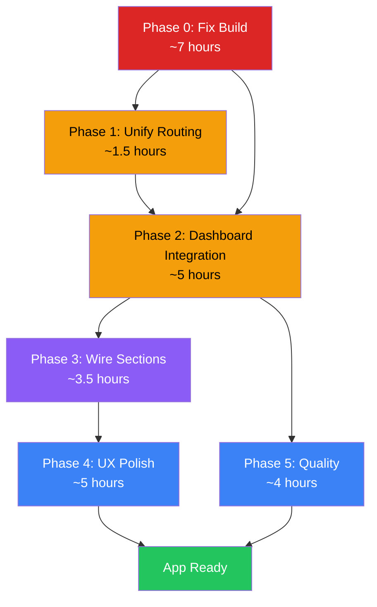

# Plot Application — Full Implementation Plan

> **Generated**: 2026-05-01 · **Based on**: Deep codebase scan + `tsc --noEmit` analysis (90+ errors)

---

## Executive Summary

The Plot codebase has **two parallel, disconnected application architectures** and a **fundamental schema mismatch** between the pages that actually run and the spec-aligned components that were built but never wired in. The `tsc` build currently **fails with 90+ TypeScript errors**. The previous implementation plan incorrectly stated that core features were "complete" — in reality, the app runs a minimal legacy UI while the spec-aligned components sit unused.

> [!CAUTION]
> The app **cannot build** (`tsc && vite build` fails). The dev server works only because Vite skips TypeScript checking. Any deployment pipeline will break.

---

## Critical Issues Discovered

### Issue 1 — Two Parallel Entry Points (App Never Uses AppRouter)

| File | Role | Status |
|---|---|---|
| [main.tsx](file:///f:/_product/Plot/plot-app/src/main.tsx) | Entry point | Imports `App.tsx` |
| [App.tsx](file:///f:/_product/Plot/plot-app/src/App.tsx) | **Active** router | Renders its own `<Router>` with inline routes. No auth, no `AppRouter`. Has a hardcoded link to `/stories/demo-story-id` |
| [AppRouter.tsx](file:///f:/_product/Plot/plot-app/src/routes/AppRouter.tsx) | **Dead code** | Full auth flow, landing page, `ProtectedRoute`, Dashboard, StoryEditor. **Never imported anywhere** |

**Result**: Auth, landing page, Dashboard, and StoryEditor pages are **completely unreachable**. The user only ever sees the demo `UnifiedStoryDashboard` at `/stories/:storyId`.

### Issue 2 — Legacy Schema in Dashboard & StoryEditor vs. Spec Schema

| Component | Schema It Uses | Spec Schema |
|---|---|---|
| [Dashboard.tsx L43-51](file:///f:/_product/Plot/plot-app/src/pages/Dashboard.tsx#L43-L51) | `INSERT { name, overview, characters, plot, notes }` (flat text columns) | `INSERT { title, theme, description, world_settings }` (relational with separate tables) |
| [StoryEditor.tsx L16-19](file:///f:/_product/Plot/plot-app/src/pages/StoryEditor.tsx#L16-L19) | Reads `story.name`, `story.overview`, `story.characters`, `story.plot`, `story.notes` as flat strings | Spec has `story.title`, separate `characters` table, `scenes` table, etc. |
| [story.types.ts](file:///f:/_product/Plot/plot-app/src/types/story.types.ts) | Correctly defines spec schema (Story, Character, Scene, etc.) | Matches spec |

**Result**: Dashboard and StoryEditor are talking to **database columns that don't exist** in the spec schema. If the migration was applied, these pages will crash with Supabase errors.

### Issue 3 — UnifiedStoryDashboard Is Half-Built

[UnifiedStoryDashboard.tsx](file:///f:/_product/Plot/plot-app/src/components/dashboard/UnifiedStoryDashboard.tsx):
- **Line 27**: Destructures `story, characters, scenes, ...` from `useStoryManager()` but the hook returns `{ data: { story, characters, ... } }` — **wrong level of destructuring** (TS error)
- **Line 32**: Accesses `dataError.message` but `dataError` is `string | null`, not an `Error` object
- **Line 64**: Tab navigation uses `console.log('Switch to tab:', tab)` — **tabs don't actually switch**
- **Line 74-80**: Always renders `<OverviewSection>`, never shows Characters/Scenes/Writing/Resources sections
- No auth protection — anyone can visit `/stories/:id`

### Issue 4 — useStoryData Hook Has 25+ Type Errors

[useStoryData.ts](file:///f:/_product/Plot/plot-app/src/hooks/useStoryData.ts):
- **Lines 117-121**: Default values use `null` where types expect `string | undefined` (repeated pattern)
- **Lines 129, 215, 346, 428**: Passes `Partial<T>` to API functions that expect `Omit<T, ...>` (required fields missing)
- **Lines 132, 218, 349, 439**: `optimisticUpdate` return type `{ id: string }[]` doesn't satisfy full entity types
- **Line 276**: `originalOrder` declared but never used
- **Line 294**: `updateWriting` declared as `useCallback` but **never included in the return object** (Line 316)
- **Line 316**: Return object missing `updateWriting` — breaks `StoryManager` interface

### Issue 5 — API Layer Type Mismatches

[api.ts](file:///f:/_product/Plot/plot-app/src/lib/api.ts):
- **Lines 30, 37-41**: `handleResponse()` expects `Promise<any>` but receives Supabase `PostgrestBuilder` / `PostgrestFilterBuilder` objects. These are thenable but not true Promises, causing TS errors.
- **Lines 11-12**: `WritingSession` and `WritingVersion` type aliases declared but never used.

### Issue 6 — Component Files With Errors

| File | Error Summary |
|---|---|
| `SceneSection.tsx` L2 | Imports `SceneGrid` which **does not exist** (file is missing) |
| `SceneSection.tsx` L25 | `draggedSceneId` declared but never read |
| `SceneSection.tsx` L60 | `handleReorder` declared but never read |
| `ConflictBuilder.tsx` L65 | Type error in conflict creation call |
| `WritingSection.tsx` L32,66 | Calls `.then()` on `onWritingUpdate()` which returns `void`, not `Promise` |
| `WritingSection.tsx` L79 | `EditorToolbar` passed `isSaving` prop not in its prop types |
| `EditorToolbar.tsx` L19,38 | Type inconsistencies in prop definitions |
| `ResourceLinker.tsx` L114-218 | Multiple type errors in entity linking logic |
| `ResourceModal.tsx` | Form data types mismatch |
| Auth pages (4 files) | `@/lib/supabase` module resolution errors (path alias) |
| `DashboardNavbar.tsx` | Import/type errors |
| Various scene form stubs | Placeholder components with type errors |

### Issue 7 — Structural Dead Code & Missing Files

- `src/components/sections/` (HeroSection, FeaturesSection, VisualsSection, CTASection) — Landing page components, only used by dead `AppRouter.tsx`
- `src/components/story/UnifiedStoryOverview.tsx` — Complete 305-line component, **never imported anywhere**
- `src/pages/Characters.tsx` — 14KB standalone characters page, **never routed to**
- `src/components/scene-section/SceneSection.tsx` imports `./SceneGrid` which **doesn't exist as a file** (only `SceneCard.tsx` exists)
- `src/components/scene-section/forms/` has 14 files, many are stub placeholders

---

## Implementation Plan

### Phase 0: Foundation — Fix Build (MUST DO FIRST)

> [!IMPORTANT]
> Nothing else can be verified or deployed until the build passes. All 90+ errors must be resolved.

#### Task 0.1: Fix Type Definitions (null vs undefined)

**File**: [src/types/story.types.ts](file:///f:/_product/Plot/plot-app/src/types/story.types.ts)

The root cause of ~30% of errors. Supabase returns `null` for empty JSONB fields, but the types use `string | undefined`. Fix by allowing `null` in optional nested fields.

**Changes needed**:
```diff
 // In Character interface
 motivation: {
-    goal?: string;
-    fear?: string;
-    desire?: string;
+    goal?: string | null;
+    fear?: string | null;
+    desire?: string | null;
 };
 // Same pattern for: traits, conflicts, arc, Scene.setting, Scene.events, Scene.conflicts
```

**Affected interfaces**: `Character.motivation`, `Character.conflicts`, `Character.arc`, `Scene.setting`, `Scene.events`, `Scene.conflicts`

**Estimated effort**: 30 minutes

---

#### Task 0.2: Fix useStoryData Hook (25 errors)

**File**: [src/hooks/useStoryData.ts](file:///f:/_product/Plot/plot-app/src/hooks/useStoryData.ts)

| Line(s) | Issue | Fix |
|---|---|---|
| 62-67 | `response.data` typed as `{}` — missing Story fields | Cast `response.data as any` or define a `FullStoryResponse` type that extends Story with nested arrays |
| 82-91 | `optimisticUpdate` generic constraint too loose — returns `{ id: string }[]` | Change constraint to `<T extends Record<string, any> & { id: string }>` and ensure return matches `T[]` |
| 117-121 | Default values use `null` (e.g., `{ goal: null }`) | Change to `undefined` or update types (Task 0.1) |
| 129, 215, 346, 428 | `Partial<T>` passed to `createXxx()` which requires `Omit<T, 'id'\|...>` | Add type assertion: `characterData as Omit<Character, 'id'\|'story_id'\|...>` |
| 132, 218, 349, 439 | `optimisticUpdate` return doesn't satisfy full entity type | Fix the generic so it returns `T[]` not `{ id: string }[]` |
| 134, 220, 351 | `{}` passed to `optimisticUpdate` which expects `{ id: string }` | Pass `response.data!` which includes `id` |
| 276 | `originalOrder` unused | Remove or prefix with `_` |
| 294 | `updateWriting` useCallback unused in scope | This IS the implementation — it needs to be returned |
| 316 | Return object missing `updateWriting` | Add `updateWriting` to the return object (it's defined at L294 but not returned) |

**Estimated effort**: 2 hours

---

#### Task 0.3: Fix API Layer Types

**File**: [src/lib/api.ts](file:///f:/_product/Plot/plot-app/src/lib/api.ts)

| Line(s) | Issue | Fix |
|---|---|---|
| 11-12 | Unused type aliases `WritingSession`, `WritingVersion` | Remove them |
| 15 | `handleResponse` accepts `Promise<any>` but receives Postgrest builders | Change signature to `handleResponse<T>(promise: PromiseLike<any>)` — Supabase builders are `PromiseLike` but not `Promise` |
| 30, 37-41 | Same Postgrest builder issue in `getFullStory` | Covered by the signature fix above |

**Estimated effort**: 30 minutes

---

#### Task 0.4: Fix Component TypeScript Errors

**Files**: Multiple component files

| File | Issue | Fix |
|---|---|---|
| `SceneSection.tsx` L2 | Imports non-existent `./SceneGrid` | Change to render scenes inline or create a `SceneGrid.tsx` |
| `SceneSection.tsx` L25, L60 | Unused `draggedSceneId`, `handleReorder` | Remove or prefix with `_` |
| `ConflictBuilder.tsx` L65 | Type error in conflict creation | Fix the `onConflictAdd` call to pass proper typed data |
| `WritingSection.tsx` L32, L66 | `.then()` on void return | Change `onWritingUpdate` prop type to return `Promise<void>` |
| `WritingSection.tsx` L79 | Extra `isSaving` prop on EditorToolbar | Add `isSaving` to `EditorToolbarProps` interface |
| `EditorToolbar.tsx` L19, L38 | Prop type issues | Align props with what WritingSection passes |
| `ResourceLinker.tsx` L114-218 | Entity linking type mismatches | Fix `linked_entities` access patterns |
| `ResourceModal.tsx` | Form data types | Align form data with `ResourceFormData` type |
| `ResourceCard.tsx` L11 | Unused variable | Remove or prefix with `_` |
| `DashboardNavbar.tsx` L1, L3 | Import errors | Fix imports to use correct module paths |
| `Navbar.tsx` L2 | Import error | Fix import path |
| `CTASection.tsx` L1 | Unused import | Remove |
| Scene form stubs (6 files) | Placeholder types | Either implement or create proper stub exports |

**Estimated effort**: 3-4 hours

---

#### Task 0.5: Fix Auth & Path Alias Issues

**Files**: `AuthContext.tsx`, auth pages, `DashboardNavbar.tsx`, `Navbar.tsx`

The `@/` path alias is configured in `vite.config.ts` but not in `tsconfig.json`.

**Fix in** [tsconfig.json](file:///f:/_product/Plot/plot-app/tsconfig.json):
```diff
 "compilerOptions": {
+    "baseUrl": ".",
+    "paths": {
+      "@/*": ["src/*"]
+    },
     "target": "ES2020",
```

This single change will resolve the `Cannot find module '@/lib/supabase'` errors across all files using the alias.

**Also fix**: `AuthContext.tsx` L45 — add explicit types for `_event` and `session` parameters in `onAuthStateChange` callback.

**Estimated effort**: 30 minutes

---

### Phase 1: Unify Routing (Entry Point)

#### Task 1.1: Switch Entry Point to AppRouter

**File**: [src/main.tsx](file:///f:/_product/Plot/plot-app/src/main.tsx)

```diff
-import App from './App'
+import AppRouter from './routes/AppRouter'

 ReactDOM.createRoot(document.getElementById('root')!).render(
   <React.StrictMode>
-    <App />
+    <AppRouter />
   </React.StrictMode>,
 )
```

**File**: `src/App.tsx` — **Delete or archive**. All its functionality exists in `AppRouter.tsx` in a better form (with auth, protected routes, proper landing page).

**Estimated effort**: 15 minutes

---

#### Task 1.2: Fix AppRouter Route for Story Editor

**File**: [src/routes/AppRouter.tsx](file:///f:/_product/Plot/plot-app/src/routes/AppRouter.tsx)

Currently the `/story/:storyId` route renders the legacy `StoryEditor`. It needs to render the `UnifiedStoryDashboard` wrapped with the proper context providers.

```diff
-<Route path="/story/:storyId" element={
-  <LoadingRoute><ProtectedRoute><StoryEditor /></ProtectedRoute></LoadingRoute>
-} />
+<Route path="/story/:storyId" element={
+  <LoadingRoute>
+    <ProtectedRoute>
+      <StoryDashboardWrapper />
+    </ProtectedRoute>
+  </LoadingRoute>
+} />
```

Create `StoryDashboardWrapper` component that:
1. Extracts `storyId` from `useParams`
2. Wraps `UnifiedStoryDashboard` with `StoryProvider`, `WritingProvider`, `UIStateProvider`
3. Includes `DashboardNavbar`

**Estimated effort**: 1 hour

---

### Phase 2: Fix Dashboard & Story Editor Integration

#### Task 2.1: Fix Dashboard.tsx to Use Spec Schema

**File**: [src/pages/Dashboard.tsx](file:///f:/_product/Plot/plot-app/src/pages/Dashboard.tsx)

**Current problem** (Lines 43-51): Inserts with `{ name, overview, characters, plot, notes }` — columns that don't exist in the spec schema.

**Fix**:
```diff
 const { data, error } = await supabase
   .from('stories')
   .insert({
-    name: storyName,
+    title: storyName,
     user_id: user.id,
-    overview: '',
-    characters: '',
-    plot: '',
-    notes: ''
+    world_settings: {
+      locations: [],
+      timePeriod: null,
+      atmosphere: null,
+      environmentDescription: null,
+      linkedResources: []
+    }
   })
```

Also fix:
- **Line 7**: Change `useState<Array<any>>` to `useState<Story[]>` and import Story type
- **Line 143**: Change `story.name` to `story.title`
- Replace `prompt()` for story creation with a proper modal component

**Estimated effort**: 1.5 hours

---

#### Task 2.2: Rebuild UnifiedStoryDashboard as Functional Hub

**File**: [src/components/dashboard/UnifiedStoryDashboard.tsx](file:///f:/_product/Plot/plot-app/src/components/dashboard/UnifiedStoryDashboard.tsx)

Current state: 86 lines, hardcoded to show only OverviewSection, broken destructuring, console.log handlers.

**Required changes**:
1. **Fix data access** — use `useStory()` from `StoryContext` instead of direct `useStoryManager()` (context is the proper abstraction layer)
2. **Implement tab switching** with `useState<'overview' | 'characters' | 'scenes' | 'writing' | 'resources'>`
3. **Render correct section** based on active tab:
   - `overview` → `<OverviewSection>`
   - `characters` → `<CharacterSection>`
   - `scenes` → `<SceneSection>`
   - `writing` → `<WritingSection>`
   - `resources` → `<ResourcesSection>`
4. **Wire real handlers** from `useStory()` context to each section's CRUD props
5. **Remove duplicate state** (local `loading`/`error` that shadow context state)

**Estimated effort**: 2-3 hours

---

#### Task 2.3: Create Missing SceneGrid Component

**File**: `src/components/scene-section/SceneGrid.tsx` (NEW)

`SceneSection.tsx` imports this but it doesn't exist. Either:
- **Option A**: Create a simple grid component that maps scenes to `SceneCard` components
- **Option B**: Refactor `SceneSection.tsx` to not depend on it (render inline)

**Recommended**: Option A — keeps component separation clean.

**Estimated effort**: 1 hour

---

### Phase 3: Wire Section Components to Context

#### Task 3.1: Wire CharacterSection

**File**: Integration in UnifiedStoryDashboard

The `CharacterSection` component is already well-built with:
- CharacterGrid, CharacterCard, CharacterModal
- 7 form sub-components (BasicInfo, Motivation, Traits, Conflicts, Relationships, Arc, Resources)
- RelationshipGraph

**Wire up**:
```tsx
<CharacterSection
  characters={characters}
  onCharacterAdd={addCharacter}
  onCharacterUpdate={updateCharacter}
  onCharacterDelete={deleteCharacter}
/>
```

**Estimated effort**: 30 minutes

---

#### Task 3.2: Wire SceneSection

After creating `SceneGrid.tsx` (Task 2.3):

```tsx
<SceneSection
  scenes={scenes}
  characters={characters}
  onSceneAdd={addScene}
  onSceneUpdate={updateScene}
  onSceneDelete={deleteScene}
  onReorderScenes={reorderScenes}
/>
```

**Estimated effort**: 30 minutes

---

#### Task 3.3: Wire WritingSection

**Current issue**: `WritingSection` calls `.then()` on `onWritingUpdate(content)` but the context function returns `void`.

**Fix**: Either make `onWritingUpdate` return `Promise<void>` (already is async in context, just needs the prop type fixed) or handle async inside the section.

```tsx
<WritingSection
  writingSession={writingSession}
  characters={characters}
  scenes={scenes}
  onWritingUpdate={updateWriting}
/>
```

**Estimated effort**: 1 hour

---

#### Task 3.4: Wire ResourcesSection

```tsx
<ResourcesSection
  resources={resources}
  onResourceAdd={addResource}
  onResourceUpdate={updateResource}
  onResourceDelete={deleteResource}
/>
```

**Estimated effort**: 30 minutes

---

#### Task 3.5: Integrate UnifiedStoryOverview

**File**: [src/components/story/UnifiedStoryOverview.tsx](file:///f:/_product/Plot/plot-app/src/components/story/UnifiedStoryOverview.tsx)

This 305-line component provides a rich structured overview (Premise, Characters, Conflicts, Narrative Arc) but is **never imported anywhere**.

**Options**:
- Replace the current `OverviewSection` component with this one
- Or integrate it as a sub-component within the overview tab

The current `OverviewSection` renders `BasicInfoPanel` and `WorldSettingsPanel`. The `UnifiedStoryOverview` provides different functionality (structured narrative overview). Both should coexist in the overview tab.

**Estimated effort**: 1 hour

---

### Phase 4: UX Polish & Missing Features

#### Task 4.1: Implement Toast Notification System

**Context**: `UIStateContext.tsx` already has `showNotification` / `hideNotification` wired up with state management and 3-second auto-dismiss. But there's **no visual Toast component** rendering it.

**Create**: `src/components/ui/Toast.tsx`
- Read notification state from `useUIState()`
- Render a slide-in toast with proper styling
- Include in the root layout

**Estimated effort**: 1 hour

---

#### Task 4.2: Loading Skeletons

**Current state**: Loading states show basic "Loading..." text or spinner dots. Need proper skeleton placeholders for:
- Story cards in Dashboard grid
- Character cards in CharacterGrid
- Scene list items
- Overview sections

**Create**: `src/components/ui/Skeleton.tsx` with variants for card, list-item, and text-block.

**Estimated effort**: 2 hours

---

#### Task 4.3: Story Creation Modal (Replace prompt())

**File**: [src/pages/Dashboard.tsx](file:///f:/_product/Plot/plot-app/src/pages/Dashboard.tsx)

Replace the `prompt('Enter story name:')` calls (Lines 91, 125) with a proper modal that:
- Has a styled input for story title
- Optional theme and description fields
- Matches the dark-purple design system
- Has proper validation

**Estimated effort**: 1.5 hours

---

#### Task 4.4: Delete Legacy StoryEditor

**File**: [src/pages/StoryEditor.tsx](file:///f:/_product/Plot/plot-app/src/pages/StoryEditor.tsx)

Once `UnifiedStoryDashboard` is properly wired (Phase 2-3), this 339-line file is dead code. It uses the wrong schema and provides a minimal textarea-based editor.

**Action**: Delete or archive. Ensure no imports reference it.

**Estimated effort**: 15 minutes

---

### Phase 5: Quality & Stability

#### Task 5.1: Fix Global CSS Transition

**File**: [src/index.css](file:///f:/_product/Plot/plot-app/src/index.css) Line 21

```css
* {
  transition: 200ms;
}
```

This applies a 200ms transition to **every CSS property on every element**, causing layout shifts, janky scrollbars, and performance issues.

**Fix**: Remove and apply transitions only to specific interactive elements via Tailwind `transition-colors`, `transition-transform`, etc.

**Estimated effort**: 30 minutes

---

#### Task 5.2: Add Error Boundaries

**Create**: `src/components/ui/ErrorBoundary.tsx`

Wrap major sections (Dashboard, StoryEditor, each tab section) with error boundaries to prevent full-app crashes.

**Estimated effort**: 1 hour

---

#### Task 5.3: Supabase RPC Functions Check

**File**: [src/lib/api.ts](file:///f:/_product/Plot/plot-app/src/lib/api.ts) Lines 280-298

`resourceAPI.linkResourceToEntity` and `unlinkResourceFromEntity` call Supabase RPC functions (`link_resource_to_entity`, `unlink_resource_from_entity`). Check if these functions were created in the migration file.

**File**: `supabase/migrations/20260430000000_unified_story_dashboard.sql`

If these RPCs don't exist, resource linking will silently fail. Either create the RPC functions or implement the logic client-side via direct JSONB updates.

**Estimated effort**: 1-2 hours

---

#### Task 5.4: Fix Autosave in WritingSection

**File**: [src/components/writing-section/WritingSection.tsx](file:///f:/_product/Plot/plot-app/src/components/writing-section/WritingSection.tsx)

The autosave `useEffect` (Lines 26-45) runs on every `content` change including the initial render, triggering unnecessary saves.

**Fix**: Add a `isDirty` ref to skip the initial render and only save when content has actually changed from the loaded value.

**Estimated effort**: 30 minutes

---

## Implementation Order & Dependencies



## Estimated Total Effort

| Phase | Hours | Priority |
|---|---|---|
| **Phase 0**: Fix Build | ~7h | CRITICAL — app cannot build |
| **Phase 1**: Unify Routing | ~1.5h | CRITICAL — app runs wrong code |
| **Phase 2**: Dashboard Integration | ~5h | HIGH — core functionality |
| **Phase 3**: Wire Sections | ~3.5h | HIGH — feature completeness |
| **Phase 4**: UX Polish | ~5h | MEDIUM — user experience |
| **Phase 5**: Quality & Stability | ~4h | MEDIUM — production readiness |
| **Total** | **~26h** | |

## Files to Delete After Migration

| File | Reason |
|---|---|
| `src/App.tsx` | Replaced by `AppRouter.tsx` |
| `src/pages/StoryEditor.tsx` | Replaced by `UnifiedStoryDashboard` |
| `src/pages/Characters.tsx` | 14KB standalone page, never routed — functionality exists in `CharacterSection` |

## Key Decisions Needed

1. **Landing page**: Keep the HeroSection/FeaturesSection/CTASection landing page from AppRouter, or simplify?
2. **Scene forms**: There are 14 form files in `scene-section/forms/`, many are stubs. Implement all, or consolidate into fewer multi-section forms?
3. **Resource linking RPCs**: Implement as Supabase server-side functions or handle client-side?
4. **Export functionality**: WritingSection has export button wired to `alert()`. Implement PDF/EPUB/Markdown export now or defer?
