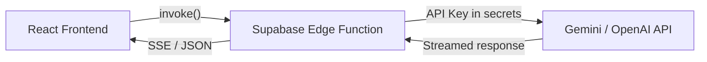

# AI Features — Implementation Plan

**Project:** Plot App (`f:\_product\Plot\plot-app`)  
**Date:** 2026-05-05  
**PRD Ref:** Section 6 — Future Scope (items 1–3)

---

## Executive Summary

Three AI features to be added to the Plot storytelling app:

| # | Feature | Integration Point | User Value |
|---|---------|-------------------|------------|
| 1 | **AI-Assisted Writing** | Writing Section (Manuscript Mode) | Expand, rewrite, continue prose from structured data |
| 2 | **AI Character/Scene Generation** | Character Section + Scene Section | Generate full character profiles or scene blueprints from minimal input |
| 3 | **AI Image Prompt Generation** | Character Cards, Scene Cards, Resources | Produce detailed image-gen prompts from story context |

---

## Architecture Decision

### AI Backend Strategy

> [!IMPORTANT]
> The frontend is a Vite SPA deployed on Vercel. API keys **cannot** be exposed client-side. We need a secure proxy.

**Chosen approach: Supabase Edge Functions**



**Why Edge Functions over a custom FastAPI backend:**
- Zero new infrastructure — already using Supabase
- Secrets managed via `supabase secrets set`
- Built-in auth context (user JWT forwarded automatically)
- Sub-100ms cold start (Deno runtime)
- Streaming support via `ReadableStream`

**Provider choice:** Start with **Google Gemini 2.5 Flash** (cost-effective, fast, large context). Abstract the provider interface so OpenAI can be swapped in later.

---

## Phase 0 — Foundation Layer

> Core infrastructure shared by all three features.

### Task 0.1 — Environment & Config

| Item | Detail |
|---|---|
| New env var | `VITE_SUPABASE_FUNCTIONS_URL` (auto-derived from `VITE_SUPABASE_URL`) |
| Supabase secret | `GEMINI_API_KEY` — set via `supabase secrets set GEMINI_API_KEY=<key>` |
| Config file | `src/lib/ai-config.ts` — models, token limits, feature flags |

**`src/lib/ai-config.ts`**
```typescript
export const AI_CONFIG = {
  enabled: true,
  provider: 'gemini' as const,
  models: {
    writing: 'gemini-2.5-flash',
    generation: 'gemini-2.5-flash',
    imagePrompt: 'gemini-2.5-flash',
  },
  limits: {
    maxInputTokens: 8000,
    maxOutputTokens: 4000,
    requestsPerMinute: 10,
  },
};
```

### Task 0.2 — AI Service Layer (`src/lib/ai-service.ts`)

Central client that calls Supabase Edge Functions:

```typescript
// Key exports:
export const aiService = {
  assistWriting(payload: WritingAssistPayload): Promise<ReadableStream<string>>,
  generateCharacter(payload: CharGenPayload): Promise<GeneratedCharacter>,
  generateScene(payload: SceneGenPayload): Promise<GeneratedScene>,
  generateImagePrompt(payload: ImagePromptPayload): Promise<string>,
};
```

- Uses `supabase.functions.invoke()` for non-streaming
- Uses `fetch()` with SSE for streaming responses
- Includes retry logic (max 2 retries with exponential backoff)
- Rate limiting via existing `src/lib/rate-limiter.ts`

### Task 0.3 — Shared AI Types (`src/types/ai.types.ts`)

```typescript
export interface AIRequestBase {
  storyId: string;
  storyContext: StoryContextSnapshot;
}

export interface StoryContextSnapshot {
  title: string;
  theme?: string;
  description?: string;
  worldSettings: WorldSettings;
  characters: CharacterSummary[];
  scenes: SceneSummary[];
  conflicts: ConflictSummary[];
}

// Feature-specific payloads extend AIRequestBase
export interface WritingAssistPayload extends AIRequestBase {
  action: 'continue' | 'expand' | 'rewrite' | 'dialogue' | 'describe';
  selectedText?: string;
  cursorContext?: string; // surrounding 500 chars
  instructions?: string;
}

export interface CharGenPayload extends AIRequestBase {
  seed: { name?: string; role?: string; description?: string };
  style: 'detailed' | 'minimal';
}

export interface SceneGenPayload extends AIRequestBase {
  seed: { title?: string; type?: string; afterSceneId?: string };
  includeDialogue: boolean;
}

export interface ImagePromptPayload extends AIRequestBase {
  entityType: 'character' | 'scene' | 'world';
  entityId: string;
  style: 'photorealistic' | 'illustration' | 'concept-art' | 'anime';
  aspectRatio: '1:1' | '16:9' | '9:16' | '3:4';
}

export interface GeneratedCharacter {
  name: string;
  role: Character['role'];
  description: string;
  motivation: Character['motivation'];
  traits: Character['traits'];
  conflicts: Character['conflicts'];
  arc: Character['arc'];
}

export interface GeneratedScene {
  title: string;
  type: Scene['type'];
  goal: string;
  setting: Scene['setting'];
  context: string;
  situation_details: string;
  events: Scene['events'];
  conflicts: Scene['conflicts'];
  dialogue: Scene['dialogue'];
  outcome: string;
}
```

### Task 0.4 — Context Builder Utility (`src/utils/ai-context-builder.ts`)

Builds a `StoryContextSnapshot` from current `StoryContext` data, with token-budgeting:

- Truncates long descriptions to stay within `maxInputTokens`
- Prioritizes: characters by role (main > antagonist > supporting) → scenes by order → conflicts
- Character summaries: name + role + 1-line description + traits
- Scene summaries: title + type + goal + setting

### Task 0.5 — Supabase Edge Function Scaffold

Create `supabase/functions/` directory with shared utilities:

```
supabase/functions/
├── _shared/
│   ├── cors.ts          # CORS headers
│   ├── auth.ts          # JWT verification
│   └── gemini-client.ts # Gemini API wrapper
├── ai-writing-assist/
│   └── index.ts
├── ai-generate-entity/
│   └── index.ts
└── ai-image-prompt/
    └── index.ts
```

Each function: validates JWT → parses body → calls Gemini → returns response.

### Task 0.6 — AI Usage Tracking Table (Migration)

```sql
CREATE TABLE ai_usage (
  id UUID PRIMARY KEY DEFAULT gen_random_uuid(),
  user_id UUID REFERENCES auth.users(id) NOT NULL,
  story_id UUID REFERENCES stories(id),
  feature TEXT NOT NULL, -- 'writing_assist' | 'char_gen' | 'scene_gen' | 'image_prompt'
  model TEXT NOT NULL,
  input_tokens INT,
  output_tokens INT,
  created_at TIMESTAMPTZ DEFAULT now()
);

-- RLS: users can only see their own usage
ALTER TABLE ai_usage ENABLE ROW LEVEL SECURITY;
CREATE POLICY "Users see own usage" ON ai_usage
  FOR SELECT USING (auth.uid() = user_id);
```

---

## Phase 1 — AI-Assisted Writing

> Inline AI assistance in the Manuscript Mode editor.

### Task 1.1 — Edge Function: `ai-writing-assist`

**Endpoint:** `POST /functions/v1/ai-writing-assist`

**System prompt strategy:**
```
You are a creative writing assistant for a storytelling app called Plot.
You have access to the story's characters, scenes, conflicts, and world settings.
Your task is to {action} the following text while maintaining consistency with 
the story's established tone, character voices, and narrative arc.
```

**Actions supported:**

| Action | Input | Output |
|---|---|---|
| `continue` | Last 500 chars + story context | Next 200-400 words |
| `expand` | Selected paragraph + context | Expanded version (2-3x length) |
| `rewrite` | Selected text + instructions | Rewritten version |
| `dialogue` | Scene context + characters present | 3-5 dialogue exchanges |
| `describe` | Scene setting/mood | Atmospheric description paragraph |

**Streaming:** Yes — returns SSE stream for `continue` and `expand`.

### Task 1.2 — AI Writing Toolbar Component

**File:** `src/components/writing-section/AIWritingToolbar.tsx`

A floating toolbar that appears when text is selected or via a dedicated button:

```
┌─────────────────────────────────────────┐
│  ✨ AI Assist                           │
│  [Continue ▸] [Expand] [Rewrite]        │
│  [Add Dialogue] [Describe Setting]      │
│  ┌──────────────────────────────────┐   │
│  │ Custom instruction...            │   │
│  └──────────────────────────────────┘   │
│                          [Generate ▸]   │
└─────────────────────────────────────────┘
```

**Behavior:**
- Shows inline below cursor when no selection (offers `continue`)
- Shows as floating popover on text selection (offers `expand`, `rewrite`)
- Streaming output renders in a diff-preview panel below the toolbar
- User clicks "Accept" to insert or "Discard" to cancel
- Keyboard shortcut: `Ctrl+Space` to toggle

### Task 1.3 — AI Streaming Preview Component

**File:** `src/components/writing-section/AIStreamPreview.tsx`

- Renders streaming tokens with a typing animation
- Shows a subtle magenta border to distinguish AI-generated text
- Accept / Discard / Regenerate buttons
- Token count display

### Task 1.4 — Integrate into WritingSection

**Modify:** `src/components/writing-section/WritingSection.tsx`

- Add AI toolbar toggle state
- Pass selection state and cursor context to `AIWritingToolbar`
- Handle accept/discard callbacks to update `contentChunks`
- Add "AI Assist" button to `EditorToolbar.tsx` alongside "Forge Skeleton"

### Task 1.5 — Integrate into EditorToolbar

**Modify:** `src/components/writing-section/EditorToolbar.tsx`

- Add `onAIAssist` prop
- New button with sparkle icon: `✨ AI Assist`
- Style consistent with existing "Forge Skeleton" button

---

## Phase 2 — AI Character & Scene Generation

> Generate complete character profiles or scene blueprints from minimal seeds.

### Task 2.1 — Edge Function: `ai-generate-entity`

**Endpoint:** `POST /functions/v1/ai-generate-entity`

**Body:** `{ type: 'character' | 'scene', seed: {...}, storyContext: {...} }`

**System prompt for characters:**
```
Generate a detailed character for a story with the following context.
Return a JSON object matching this exact schema: { name, role, description, 
motivation: { goal, fear, desire }, traits: { strengths[], weaknesses[], 
personality[] }, conflicts: { internal, external }, arc: { start, end } }.
Ensure the character fits naturally into the existing story world and 
creates interesting dynamics with existing characters.
```

**System prompt for scenes:**
```
Generate a detailed scene blueprint. Return JSON matching: { title, type, 
goal, setting: { location, time, environment }, context, situation_details, 
events: { main, turningPoint }, conflicts: { internal, external }, 
dialogue: [{ characterId, content, type }], outcome }.
Use existing character IDs in dialogue. Place the scene logically 
in the story's narrative arc.
```

**Response:** Validated JSON matching `GeneratedCharacter` or `GeneratedScene`.

### Task 2.2 — AI Generate Button for Characters

**Modify:** `src/components/character-section/CharacterSection.tsx`

- Add `✨ AI Generate` button next to "Forge New Identity"
- Opens `AICharacterGenerateModal`

### Task 2.3 — AI Character Generate Modal

**File:** `src/components/character-section/AICharacterGenerateModal.tsx`

```
┌──────────────────────────────────────────┐
│  ✨ AI Character Forge                   │
│                                          │
│  Name (optional):  [________________]    │
│  Role:             [Main        ▼   ]    │
│  Brief idea:       [________________]    │
│  Style:     ○ Detailed   ○ Minimal       │
│                                          │
│  ┌──────────────────────────────────┐    │
│  │  Generated Preview               │    │
│  │  Name: ...                        │    │
│  │  Role: ...                        │    │
│  │  Traits: ...                      │    │
│  │  [full preview of all fields]     │    │
│  └──────────────────────────────────┘    │
│                                          │
│  [Regenerate 🔄]  [Edit & Save] [Accept] │
└──────────────────────────────────────────┘
```

**Flow:**
1. User provides minimal seed → clicks Generate
2. Shows loading state with shimmer animation
3. Preview rendered in read-only CharacterDetailView style
4. "Edit & Save" opens the standard CharacterModal pre-filled with AI data
5. "Accept" saves directly via `addCharacter()`

### Task 2.4 — AI Generate Button for Scenes

**Modify:** `src/components/scene-section/SceneSection.tsx`

- Add `✨ AI Generate` button next to "Chronicle New Scene"
- Opens `AISceneGenerateModal`

### Task 2.5 — AI Scene Generate Modal

**File:** `src/components/scene-section/AISceneGenerateModal.tsx`

Similar UX to character generation:
- Seed: title, type, "place after scene X"
- Toggle: include dialogue or not
- Preview: scene detail view style
- Accept / Edit & Save / Regenerate

### Task 2.6 — Generation Preview Components

**File:** `src/components/ai/AIGenerationPreview.tsx`

Shared preview component with:
- Shimmer loading skeleton
- JSON → styled card renderer
- Diff highlighting (for regeneration comparisons)

---

## Phase 3 — AI Image Prompt Generation

> Generate detailed image-generation prompts from character/scene data.

### Task 3.1 — Edge Function: `ai-image-prompt`

**Endpoint:** `POST /functions/v1/ai-image-prompt`

**System prompt:**
```
You are an expert at writing image generation prompts. Given the following 
{character/scene/world} data from a story, create a detailed, visually rich 
prompt suitable for AI image generation tools like Midjourney, DALL-E, or 
Stable Diffusion. Include: subject description, composition, lighting, 
color palette, mood, art style ({style}), and aspect ratio ({aspectRatio}).
Return only the prompt text, no explanations.
```

**Response:** Plain text prompt string (200-400 words).

### Task 3.2 — Image Prompt Button on Character Cards

**Modify:** `src/components/character-section/CharacterCard.tsx`

- Add `🎨` icon button in card actions
- Opens `ImagePromptModal` with `entityType='character'`

### Task 3.3 — Image Prompt Button on Scene Cards

**Modify:** `src/components/scene-section/SceneCard.tsx`

- Add `🎨` icon button in card actions
- Opens `ImagePromptModal` with `entityType='scene'`

### Task 3.4 — Image Prompt Modal

**File:** `src/components/ai/ImagePromptModal.tsx`

```
┌──────────────────────────────────────────┐
│  🎨 Image Prompt Forge                   │
│                                          │
│  Entity: "Marcus Rivera" (Character)     │
│                                          │
│  Style:  [Photorealistic ▼]              │
│  Ratio:  ○ 1:1  ○ 16:9  ○ 9:16  ○ 3:4  │
│                                          │
│  [Generate Prompt ✨]                    │
│                                          │
│  ┌──────────────────────────────────┐    │
│  │ A weathered detective in his      │    │
│  │ late 40s, sharp jawline with a    │    │
│  │ three-day stubble, wearing a      │    │
│  │ worn leather jacket over a dark   │    │
│  │ henley shirt. Deep-set hazel      │    │
│  │ eyes that carry the weight of...  │    │
│  └──────────────────────────────────┘    │
│                                          │
│  [📋 Copy]  [🔄 Regenerate]  [💾 Save]  │
└──────────────────────────────────────────┘
```

**Actions:**
- **Copy** — copies prompt to clipboard
- **Regenerate** — calls API again with same params
- **Save as Resource** — creates a new Resource (type: `note`, title: `Image Prompt — {entity name}`) linked to the entity

### Task 3.5 — Save Prompt as Resource Integration

Uses existing `resourceAPI.createResource()` + `resourceAPI.linkResourceToEntity()` — no new API needed.

---

## Phase 4 — UI Polish & Error Handling

### Task 4.1 — AI Loading States

**File:** `src/components/ai/AILoadingOverlay.tsx`

- Shimmer skeleton matching each output type
- Animated sparkle/wand icon
- "Thinking..." → "Generating..." → "Polishing..." progressive status

### Task 4.2 — Error Handling & Fallbacks

- Network errors → retry with toast notification
- Rate limit hit → show cooldown timer
- API key missing → graceful degradation (hide AI buttons)
- Invalid response → show raw text with "couldn't parse" message

### Task 4.3 — AI Feature Flag Toggle

**Modify:** `src/lib/ai-config.ts`

- Check `AI_CONFIG.enabled` before rendering any AI buttons
- Gate on `VITE_AI_ENABLED=true` env var for easy toggling

### Task 4.4 — Mobile Responsive AI Modals

- All AI modals use existing mobile modal patterns (full-screen on mobile)
- Touch-friendly buttons (min 44px tap targets)
- Streaming preview scrolls to bottom on new tokens

### Task 4.5 — Token Usage Display

**File:** `src/components/ai/AIUsageBadge.tsx`

- Small badge in the AI modals showing tokens used
- Optional: daily usage summary accessible from settings

---

## Phase 5 — Testing & Deployment

### Task 5.1 — Edge Function Deployment

```bash
supabase functions deploy ai-writing-assist
supabase functions deploy ai-generate-entity
supabase functions deploy ai-image-prompt
supabase secrets set GEMINI_API_KEY=<key>
```

### Task 5.2 — Environment Setup

Update `.env.example`:
```
VITE_SUPABASE_URL="https://your-project.supabase.co"
VITE_SUPABASE_ANON_KEY="your-anon-key-here"
VITE_AI_ENABLED="true"
```

### Task 5.3 — Integration Testing Checklist

| Test Case | Expected |
|---|---|
| AI writing continue with no text | Generates opening paragraph |
| AI writing with selection | Offers expand/rewrite |
| Character gen with empty seed | Generates from story context alone |
| Character gen with name only | Fills all fields consistently |
| Scene gen "after scene 3" | Fits narrative arc logically |
| Image prompt for character | Includes physical traits, mood |
| Image prompt for scene | Includes setting, lighting, atmosphere |
| Rate limit exceeded | Shows cooldown timer |
| Network failure mid-stream | Shows partial + retry button |
| AI disabled via config | No AI buttons visible |

### Task 5.4 — Vercel Deployment Verification

- Ensure Edge Functions are accessible from Vercel-hosted frontend
- Verify CORS headers in `_shared/cors.ts`
- Test streaming responses through Vercel's edge network

---

## Task Summary

| Phase | Tasks | Description |
|---|---|---|
| **Phase 0** | 6 tasks | Foundation: config, types, service layer, edge function scaffold, DB |
| **Phase 1** | 5 tasks | AI-assisted writing in Manuscript Mode |
| **Phase 2** | 6 tasks | AI character & scene generation |
| **Phase 3** | 5 tasks | AI image prompt generation |
| **Phase 4** | 5 tasks | Polish, errors, mobile, feature flags |
| **Phase 5** | 4 tasks | Deployment & testing |
| **Total** | **31 tasks** | |

---

## File Impact Summary

### New Files (14)

| File | Purpose |
|---|---|
| `src/lib/ai-config.ts` | AI configuration & feature flags |
| `src/lib/ai-service.ts` | Frontend AI service client |
| `src/types/ai.types.ts` | AI-specific TypeScript types |
| `src/utils/ai-context-builder.ts` | Story context serialization for prompts |
| `src/components/writing-section/AIWritingToolbar.tsx` | Inline AI toolbar for editor |
| `src/components/writing-section/AIStreamPreview.tsx` | Streaming response preview |
| `src/components/character-section/AICharacterGenerateModal.tsx` | Character generation modal |
| `src/components/scene-section/AISceneGenerateModal.tsx` | Scene generation modal |
| `src/components/ai/ImagePromptModal.tsx` | Image prompt generation modal |
| `src/components/ai/AIGenerationPreview.tsx` | Shared generation preview |
| `src/components/ai/AILoadingOverlay.tsx` | Loading states |
| `src/components/ai/AIUsageBadge.tsx` | Token usage display |
| `supabase/functions/_shared/*` | Shared Edge Function utilities (3 files) |
| `supabase/functions/ai-*/index.ts` | 3 Edge Functions |

### Modified Files (7)

| File | Change |
|---|---|
| `src/components/writing-section/WritingSection.tsx` | Add AI toolbar integration |
| `src/components/writing-section/EditorToolbar.tsx` | Add AI Assist button |
| `src/components/character-section/CharacterSection.tsx` | Add AI Generate button |
| `src/components/character-section/CharacterCard.tsx` | Add image prompt button |
| `src/components/scene-section/SceneSection.tsx` | Add AI Generate button |
| `src/components/scene-section/SceneCard.tsx` | Add image prompt button |
| `.env.example` | Add `VITE_AI_ENABLED` |

---

## Dependencies

### New NPM Packages: **None**

All AI calls go through Supabase Edge Functions. No new frontend dependencies needed — `@supabase/supabase-js` already supports `functions.invoke()`.

### Supabase Requirements

- **Edge Functions** enabled on the Supabase project
- **Supabase CLI** installed for function deployment
- **Gemini API Key** stored in Supabase secrets

---

## Open Questions

1. **Provider preference** — Start with Gemini Flash? Or prefer OpenAI GPT-4o-mini?
2. **Usage limits** — Should there be a daily token cap per user? Free tier vs premium?
3. **Streaming** — Should all responses stream, or only writing assistance?
4. **Image generation** — Should Phase 3 also include *actual* image generation (calling DALL-E/Imagen), or just prompt text for now?
