# Implementation Plan — PRD Gap Remediation

**Created:** 2026-05-09  
**Source:** [PRD Completion Report](file:///f:/_product/Plot/plot-app/doc/prd_completion_report.md) §Gaps & Missing Items  
**Goal:** Close the 11% gap to reach ~97% PRD compliance + fix all quality/edge-case issues

---

## Summary of Issues to Resolve

| # | Issue | Category | Priority |
|---|---|---|---|
| T1 | Resource unlinking is incomplete during character/scene updates | Quality Bug | **P0** |
| T2 | Auto-create writing session on first Writing Mode visit | Quality Bug | **P0** |
| T3 | Scene reorder bypasses server-side RPC | Quality Bug | **P1** |
| T4 | Legacy JSON `description` parsing is fragile | Quality Bug | **P1** |
| T5 | File upload button in ResourceModal needs more visibility | PRD Gap | **P1** |
| T6 | World Settings panel lacks visible "Attach Resource" trigger | PRD Gap | **P1** |
| T7 | Resource count badges on Overview cards | Enhancement | **P2** |

---

## Execution Phases

```mermaid
gantt
    title Implementation Timeline
    dateFormat  HH:mm
    axisFormat %H:%M

    section Phase 1 - Critical
    T1 Resource Unlinking Fix    :t1, 00:00, 60min
    T2 Auto-Create Writing Session :t2, after t1, 30min
    T4 Safe JSON Parsing         :t4, after t2, 20min

    section Phase 2 - PRD Compliance
    T3 Server-Side Scene Reorder :t3, after t4, 30min
    T5 Enhanced Upload UI        :t5, after t3, 45min
    T6 World Settings Attach     :t6, after t5, 30min

    section Phase 3 - Polish
    T7 Resource Count Badges     :t7, after t6, 20min
```



**Total Estimated Effort: ~4 hours**

---

## Task Details

---

### T1 — Fix Resource Unlinking on Character/Scene Update

> **Priority:** P0 · **Effort:** ~1 hour · **Risk:** Low

#### Problem

In [api.ts](file:///f:/_product/Plot/plot-app/src/lib/api.ts#L161-L177), when a character is updated with a new set of resource IDs, only **new links are added** — old links are never removed. The code even acknowledges this with a comment:

```
// Note: This simple implementation doesn't handle unlinking. 
// In a full implementation, we'd diff the resources.
```

The same issue exists for scene updates (lines 226-240).

#### Files to Change

| File | Action |
|---|---|
| [api.ts](file:///f:/_product/Plot/plot-app/src/lib/api.ts) | Modify `characterAPI.updateCharacter()` and `sceneAPI.updateScene()` |

#### Implementation

Replace the current link-only logic with a diff-based approach that unlinks removed resources and links new ones:

**`characterAPI.updateCharacter()` (line 161):**

```diff
  updateCharacter: async (characterId: string, updates) => {
    const { resources: characterResources, ...data } = updates as any;
    
    const result = await handleResponse(
      supabase.from('characters').update(data).eq('id', characterId)
    );

-   // Note: This simple implementation doesn't handle unlinking. 
-   // In a full implementation, we'd diff the resources.
-   if (characterResources?.length) {
-     for (const resourceId of characterResources) {
-       await resourceAPI.linkResourceToEntity(resourceId, 'characters', characterId);
-     }
-   }
+   // Diff-based resource link management
+   if (characterResources !== undefined) {
+     const newIds: string[] = characterResources || [];
+     
+     // Fetch currently linked resources for this character
+     const { data: allResources } = await supabase
+       .from('resources')
+       .select('id, linked_entities')
+       .eq('story_id', data.story_id || (await supabase.from('characters').select('story_id').eq('id', characterId).single()).data?.story_id);
+     
+     const currentlyLinked = (allResources || [])
+       .filter(r => r.linked_entities?.characters?.includes(characterId))
+       .map(r => r.id);
+     
+     // Unlink removed resources
+     const toUnlink = currentlyLinked.filter(id => !newIds.includes(id));
+     for (const resourceId of toUnlink) {
+       await resourceAPI.unlinkResourceFromEntity(resourceId, 'characters', characterId);
+     }
+     
+     // Link newly added resources
+     const toLink = newIds.filter(id => !currentlyLinked.includes(id));
+     for (const resourceId of toLink) {
+       await resourceAPI.linkResourceToEntity(resourceId, 'characters', characterId);
+     }
+   }

    return result;
  },
```

**`sceneAPI.updateScene()` (line 226):** Apply the same pattern, replacing `'characters'` → `'scenes'` and `characterId` → `sceneId`.

#### Verification

1. Create a character with 2 linked resources
2. Edit the character — remove 1 resource, add a new one
3. Verify the removed resource's `linked_entities.characters` no longer contains the character ID
4. Verify the new resource's `linked_entities.characters` contains the character ID
5. Repeat for scenes

---

### T2 — Auto-Create Writing Session on First Visit

> **Priority:** P0 · **Effort:** ~30 min · **Risk:** Low

#### Problem

When a user opens Writing Mode for the first time on a new story, `writingSession` is `null`. The [WritingSection](file:///f:/_product/Plot/plot-app/src/components/writing-section/WritingSection.tsx) receives a null session but doesn't auto-create one — the user sees an empty editor with no ability to save.

#### Files to Change

| File | Action |
|---|---|
| [WritingSection.tsx](file:///f:/_product/Plot/plot-app/src/components/writing-section/WritingSection.tsx) | Add auto-creation effect on mount when `writingSession` is null |

#### Implementation

Add an effect at the top of `WritingSection` that creates a session if one doesn't exist:

```diff
+ import api from '@/lib/api';

  export const WritingSection: React.FC<WritingSectionProps> = ({
    writingSession,
    ...
  }) => {
-   const { story, conflicts, resources } = useStory();
+   const { story, conflicts, resources, refetch } = useStory();
+
+   // Auto-create writing session if missing
+   useEffect(() => {
+     if (story && !writingSession) {
+       api.writing.createWritingSession(story.id).then((res) => {
+         if (!res.error) refetch();
+       });
+     }
+   }, [story?.id]); // only on mount / story change
```

#### Verification

1. Create a brand-new story via the Dashboard
2. Navigate to Writing Mode tab
3. Confirm the editor loads without error — content area is editable
4. Type content, save, refresh — confirm persistence

---

### T3 — Use Server-Side `reorder_scenes` RPC

> **Priority:** P1 · **Effort:** ~30 min · **Risk:** Low

#### Problem

[sceneAPI.reorderScenes()](file:///f:/_product/Plot/plot-app/src/lib/api.ts#L250-L265) fires parallel `UPDATE` statements without a transaction. A server-side `reorder_scenes()` PostgreSQL function exists in [combined_migrations.sql](file:///f:/_product/Plot/plot-app/supabase/migrations/combined_migrations.sql) and runs atomically, but it's not being called.

#### Files to Change

| File | Action |
|---|---|
| [api.ts](file:///f:/_product/Plot/plot-app/src/lib/api.ts) | Replace parallel updates with single RPC call |

#### Implementation

```diff
  // Reorder scenes
- reorderScenes: async (_storyId: string, sceneIds: string[]) => {
-   const promises = sceneIds.map((id, index) =>
-     supabase.from('scenes').update({ order: index }).eq('id', id)
-   );
-   
-   const results = await Promise.all(promises);
-   const errors = results.map(r => r.error).filter(Boolean);
-   
-   if (errors.length > 0) {
-     return { data: null, error: errors[0]?.message || 'Error reordering scenes' };
-   }
-   
-   return { data: sceneIds, error: null };
- }
+ reorderScenes: async (storyId: string, sceneIds: string[]) => {
+   return handleResponse(
+     supabase.rpc('reorder_scenes', {
+       story_id_input: storyId,
+       scene_ids: sceneIds
+     })
+   );
+ }
```

> [!IMPORTANT]
> Verify the RPC parameter names match the function signature in `combined_migrations.sql`. The function was defined as `reorder_scenes(story_id_input UUID, scene_ids UUID[])`.

#### Verification

1. Create 3+ scenes
2. Reorder them via the UI
3. Refresh — confirm order persists
4. Open two tabs, reorder simultaneously — confirm no data corruption

---

### T4 — Clean Up Legacy JSON `description` Parsing

> **Priority:** P1 · **Effort:** ~20 min · **Risk:** Low

#### Problem

[OverviewSection.tsx line 57](file:///f:/_product/Plot/plot-app/src/components/dashboard/OverviewSection.tsx#L57) uses an unsafe pattern:

```tsx
story.description?.startsWith('{') ? JSON.parse(story.description).premise : story.description
```

If `description` starts with `{` but isn't valid JSON, this will crash the component.

#### Files to Change

| File | Action |
|---|---|
| [OverviewSection.tsx](file:///f:/_product/Plot/plot-app/src/components/dashboard/OverviewSection.tsx) | Wrap JSON.parse in try/catch |

#### Implementation

```diff
  <p className="text-[12px] font-serif italic ...">
-   {story.description?.startsWith('{') ? JSON.parse(story.description).premise : story.description || "No core premise established."}
+   {(() => {
+     if (!story.description) return "No core premise established.";
+     if (story.description.startsWith('{')) {
+       try {
+         return JSON.parse(story.description).premise || story.description;
+       } catch {
+         return story.description;
+       }
+     }
+     return story.description;
+   })()}
  </p>
```

#### Verification

1. Story with plain text description → renders normally
2. Story with `{"premise": "Test value"}` → shows "Test value"
3. Story with `{broken` → shows `{broken` without crash

---

### T5 — Enhance File Upload Visibility in ResourceModal

> **Priority:** P1 · **Effort:** ~45 min · **Risk:** Low

#### Problem

[ResourceForm.tsx](file:///f:/_product/Plot/plot-app/src/components/resources-section/forms/ResourceForm.tsx) already has a fully functional file upload with Supabase storage integration (lines 38-68, 128-176). However, the upload button is a small dashed-border element at the bottom — easily overlooked. The PRD expects media upload to be prominent.

#### Files to Change

| File | Action |
|---|---|
| [ResourceForm.tsx](file:///f:/_product/Plot/plot-app/src/components/resources-section/forms/ResourceForm.tsx) | Add a large upload zone when type is `image` or `document` |

#### Implementation

Add a prominent upload hero zone that shows **only** when the resource type is `image` or `document` and no file is uploaded yet. Insert this **before** the existing form grid:

```diff
  return (
    <div className="space-y-6">
+     {/* Prominent Upload Zone for Image/Document Types */}
+     {(data.type === 'image' || data.type === 'document') && !data.file_path && (
+       <div 
+         onClick={() => fileInputRef.current?.click()}
+         className="relative flex flex-col items-center justify-center p-8 md:p-12 
+                    border-2 border-dashed border-primary/30 rounded-2xl 
+                    bg-primary/[0.02] hover:bg-primary/[0.05] hover:border-primary/50 
+                    transition-all cursor-pointer group"
+       >
+         <div className="w-16 h-16 rounded-full bg-primary/10 flex items-center justify-center 
+                         mb-4 group-hover:scale-110 transition-transform">
+           <FiUpload size={24} className="text-primary" />
+         </div>
+         <p className="text-sm font-sans font-bold text-white mb-1">
+           {data.type === 'image' ? 'Upload Image' : 'Upload Document'}
+         </p>
+         <p className="text-[10px] font-mono text-editor-text-muted uppercase tracking-widest">
+           Click to browse files
+         </p>
+       </div>
+     )}
+
+     {/* Uploaded File Banner */}
+     {data.file_path && (
+       <div className="flex items-center justify-between p-4 
+                        bg-green-500/5 border border-green-500/20 rounded-xl">
+         <div className="flex items-center space-x-3">
+           <FiCheck size={16} className="text-green-400" />
+           <span className="text-sm font-mono text-green-400 truncate max-w-[200px]">
+             {data.file_path.split('/').pop()}
+           </span>
+         </div>
+         <button
+           type="button"
+           onClick={() => onUpdate({ ...data, file_path: '', url: '' })}
+           className="p-2 text-red-500/50 hover:text-red-500 transition-colors"
+         >
+           <FiX size={16} />
+         </button>
+       </div>
+     )}

      <div className="grid grid-cols-1 md:grid-cols-2 gap-6">
        {/* existing type + title fields */}
      </div>
```

Keep the existing compact upload button (lines 128-176) as a fallback for `note`/`link`/`other` types.

#### Verification

1. Open "Acquire New Asset" modal → select type "Image" → large upload zone appears
2. Select type "Document" → same large zone
3. Select type "Note" → only the small compact upload at the bottom
4. Upload a file → green banner with filename + remove button appears
5. Remove file → upload zone reappears

---

### T6 — World Settings Resource Attachment in Edit Modal

> **Priority:** P1 · **Effort:** ~30 min · **Risk:** Low

#### Problem

The [WorldSettingsPanel](file:///f:/_product/Plot/plot-app/src/components/dashboard/WorldSettingsPanel.tsx) already has `InlineResourceAttacher` rendered at line 99 — but it's in the **read-only view**, which gets hidden inside a `<div className="hidden">` in [OverviewSection.tsx line 125-127](file:///f:/_product/Plot/plot-app/src/components/dashboard/OverviewSection.tsx#L125-L127). Users never see it.

#### Files to Change

| File | Action |
|---|---|
| [WorldSettingsPanel.tsx](file:///f:/_product/Plot/plot-app/src/components/dashboard/WorldSettingsPanel.tsx) | Move `InlineResourceAttacher` inside the edit Modal |

#### Implementation

Move the `InlineResourceAttacher` from the read view (line 98-104) into the modal form (after line 207):

```diff
  // Remove from the read view (lines 98-104):
- <div className="pt-2">
-   <InlineResourceAttacher
-     entityType="worldSettings"
-     entityId={storyId}
-     linkedResourceIds={linkedResourceIds}
-   />
- </div>

  // Add inside the Modal, after the Locations section (before closing </div> at line 208):
      <div className="space-y-8">
        {/* ... existing timePeriod, atmosphere, environment, locations fields ... */}

+       {/* Resource Attachments */}
+       <div className="pt-4 border-t border-white/5">
+         <label className="block text-[10px] font-mono font-bold uppercase tracking-[0.2em] text-editor-text-muted mb-4">
+           Attached References
+         </label>
+         <InlineResourceAttacher
+           entityType="worldSettings"
+           entityId={storyId}
+           linkedResourceIds={linkedResourceIds}
+         />
+       </div>
      </div>
```

#### Verification

1. Open a story's Overview → click "Edit Setting" on the World Settings card
2. The modal now shows an "Attached References" section at the bottom
3. Attach a resource → confirm it appears linked
4. Close modal → reopen → confirm the linked resource persists

---

### T7 — Add Resource Count Badges to Overview Cards

> **Priority:** P2 · **Effort:** ~20 min · **Risk:** Low

#### Problem

The Overview cards (Foundation, Settings, Conflict) show no indication of how many resources are linked. Users have to navigate to the Resources tab to discover linked material.

#### Files to Change

| File | Action |
|---|---|
| [OverviewSection.tsx](file:///f:/_product/Plot/plot-app/src/components/dashboard/OverviewSection.tsx) | Compute counts from `resources` prop, render badge pills |
| [UnifiedStoryDashboard.tsx](file:///f:/_product/Plot/plot-app/src/components/dashboard/UnifiedStoryDashboard.tsx) | Pass `resources` to `OverviewSection` |

#### Implementation

**Step 1** — Pass `resources` to `OverviewSection`:

```diff
  // UnifiedStoryDashboard.tsx
  <OverviewSection 
    story={story} 
    characters={characters}
    conflicts={conflicts}
+   resources={resources}
    worldSettings={story.world_settings}
    ...
  />
```

**Step 2** — In `OverviewSection`, compute and render counts:

```diff
  interface OverviewSectionProps {
    story: Story;
    characters: Character[];
    conflicts: Conflict[];
+   resources: Resource[];
    worldSettings: WorldSettings;
    ...
  }

  export const OverviewSection = ({ story, characters, conflicts, resources, ... }) => {
+   const worldRefCount = resources.filter(r => 
+     r.linked_entities?.worldSettings?.includes(story.id)
+   ).length;

    return (
      // ... Settings card header:
      <h2 className="...">Setting</h2>
+     {worldRefCount > 0 && (
+       <span className="text-[8px] font-mono text-green-400 bg-green-500/10 
+              px-2 py-0.5 rounded-full border border-green-500/20 ml-auto">
+         {worldRefCount} ref{worldRefCount !== 1 ? 's' : ''}
+       </span>
+     )}
    );
  };
```

#### Verification

1. Attach 2 resources to world settings → badge shows "2 refs"
2. Unlink one → badge updates to "1 ref"
3. Unlink all → badge disappears

---

## Expected Impact

After completing all 7 tasks:

| Area | Before | After |
|---|---|---|
| Resources System | 82% | 97% |
| Writing Mode | 85% | 98% |
| Scene Builder | 90% | 98% |
| Unified Overview | 95% | 99% |
| **OVERALL** | **89%** | **~97%** |

> [!NOTE]
> The remaining ~3% consists of features explicitly marked as **"not now"** in the PRD (PDF export, collaboration). These are not gaps — they are deferred scope.
